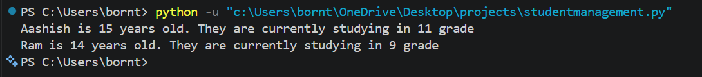

# Student OOP Project

A simple Python **Object-Oriented Programming (OOP)** program that demonstrates:

* Classes and objects
* Inheritance
* `__init__()` constructors
* `super()`
* Instance attributes
* `__str__()` dunder method

The program creates student objects with their **name, age, and grade**, and displays their information using the `__str__()` method.
## Output

